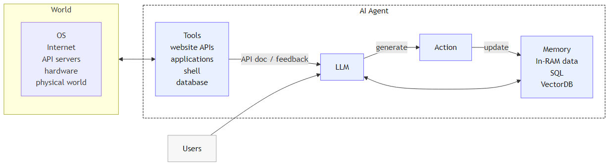

# dt4research — Technical Plan (v1.0.0.4)

Status: Delivered (Stage 3: Persistence)

## 1. Architecture Overview
- Backend: FastAPI + Pydantic
- Agent: rule-based (`app/agent_logic.py`) with .env coefficients
- Persistence: SQLite + SQLModel; repository pattern; PostgreSQL-ready
- Migrations: Alembic (deps ready)
- Frontend: Cytoscape.js; bilingual UI (EN default, UA toggle)
- Logging: console or JSON via `LOG_FORMAT`
- CORS: open by default

### Runtime control loop

Manager goal → Agent analysis → State update → Feedback.
Agent emits deltas per resource; backend persists state and writes history.

### DT model (reference)

## 2. Data Model
### Pydantic (API)
- SystemState = List[KeyComponent] + List[Resource]
- MechanismInput { target_goal: str(min_length=3) }
- MechanismResponse { newState, explanation, explanation_details }
- ResourceType (EN strings): Communication, Educational, Financial, Informational, Operational, Organizational, Risk, Strategic, Technological

### SQLModel (DB)
- ComponentRow(id, name, status)
- ResourceRow(id, name, type, value)
- AgentRunRow(id, timestamp, input_goal, applied_rules_explanation JSON, snapshot_state JSON)

## 3. Persistence Layer
Files: `app/db.py`, `app/db_models.py`, `app/repository.py`, `app/initial_state.py`.
Flow: startup → create tables + seed; GET → read DB; POST apply → read → run agent → persist state + history → return.

## 4. Environment & Config
`.env` (optional; defaults exist): LOG_FORMAT, LOG_LEVEL, RULE_* coefficients.

## 5. Frontend (EN/UA)
Language switch; translates graph labels, details, tooltips, controls; console logs `[UI]`.

## 6. Testing
`tests/test_api.py`, `tests/test_persistence.py`; run: `./venv/Scripts/python.exe -m pytest -q`.

## 7. Next steps
- Alembic migrations (baseline + seeds)
- `GET /api/v1/agent-runs/{id}` (optional)
- Restrict CORS in prod; request logging middleware

