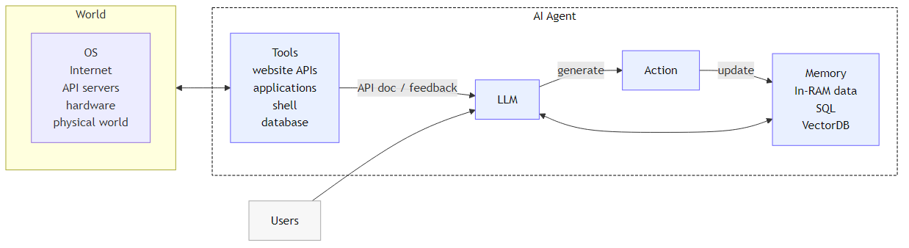
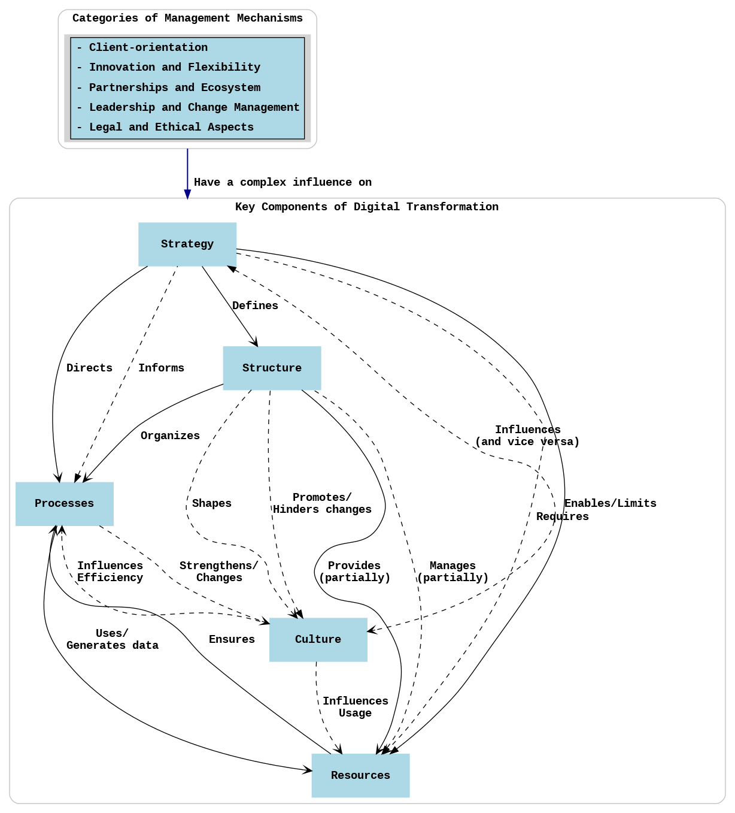
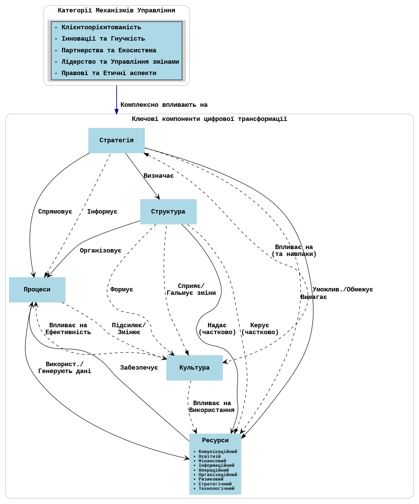

# dt4research — Технічний план (v1.0.0.4)

Статус: виконано (Етап 3: Персистентність)

## 1. Огляд архітектури
- Бекенд: FastAPI + Pydantic
- Агент: правиловий (`app/agent_logic.py`) із коефіцієнтами з .env
- Персистентність: SQLite + SQLModel; репозиторій; готовність до PostgreSQL
- Міграції: Alembic (залежності додані)
- Фронтенд: Cytoscape.js; двомовний UI (англійська за замовчуванням, перемикач на укр.)
- Логування: консоль або JSON через `LOG_FORMAT`
- CORS: відкритий за замовчуванням

### Цикл керування

Ціль менеджера → Аналіз агента → Оновлення стану → Зворотний зв’язок.
Агент формує дельти по ресурсах; бекенд зберігає стан і записує історію.

### Модель DT (референс)

## 2. Модель даних
### Pydantic (API)
- SystemState = List[KeyComponent] + List[Resource]
- MechanismInput { target_goal: str(min_length=3) }
- MechanismResponse { newState, explanation, explanation_details }
- ResourceType (EN): Communication, Educational, Financial, Informational, Operational, Organizational, Risk, Strategic, Technological

### SQLModel (БД)
- ComponentRow(id, name, status)
- ResourceRow(id, name, type, value)
- AgentRunRow(id, timestamp, input_goal, applied_rules_explanation JSON, snapshot_state JSON)

## 3. Шар персистентності
Файли: `app/db.py`, `app/db_models.py`, `app/repository.py`, `app/initial_state.py`.
Потік: старт → створення таблиць + первинний seed; GET → читання з БД; POST apply → читання → агент → запис стану + історії → відповідь.

## 4. Оточення та конфігурація
`.env` (необов’язково; є дефолти): LOG_FORMAT, LOG_LEVEL, RULE_* коефіцієнти.

## 5. Фронтенд (EN/UA)
Перемикач мови; переклад підписів вузлів, панелі деталей, тултіпів та контролів; консольні логи `[UI]`.

## 6. Тестування
`tests/test_api.py`, `tests/test_persistence.py`; запуск: `./venv/Scripts/python.exe -m pytest -q`.

## 7. Наступні кроки
- Міграції Alembic (baseline + seeds)
- `GET /api/v1/agent-runs/{id}` (за потреби)
- Обмежити CORS у prod; додати middleware логування запитів

