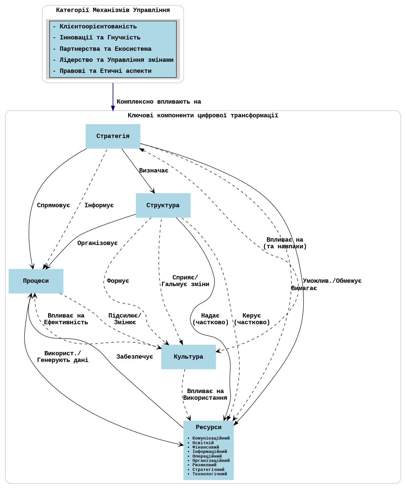

# dt4research — Технічний план (v1.4.0)

**Тема дослідження:** Формування управлінських механізмів цифрової трансформації підприємств

Статус: виконано (Етап 4: Наукова симуляція та метрики) — доповнено рушієм симуляції та аналітикою v1.4.0

## 1. Огляд архітектури
- Бекенд: FastAPI + Pydantic
- Агент: правиловий (`app/agent_logic.py`) із коефіцієнтами з .env
- Персистентність: SQLite + SQLModel; репозиторій; готовність до PostgreSQL
- Міграції: Alembic (залежності додані)
- Фронтенд: Cytoscape.js; двомовний UI (англійська за замовчуванням, перемикач на укр.)
- Логування: консоль або JSON через `LOG_FORMAT`
- CORS: відкритий за замовчуванням
- Аналітика: Обчислення наукових метрик (`app/analytics.py`)
- Симуляція: Рушій симуляції часових рядів (`app/simulation.py`)

### Цикл керування

Ціль менеджера → Аналіз агента → Оновлення стану → Зворотний зв'язок.
Агент формує дельти по ресурсах; бекенд зберігає стан і записує історію.

### Модель DT (референс)

## 2. Модель даних
### Pydantic (API)
- SystemState = List[KeyComponent] + List[Resource]
  - Розширено опціональними полями: `s_index`, `c_index`, `a_index` (float)
- MechanismInput { target_goal: str(min_length=3) }
- MechanismResponse { newState, explanation, explanation_details }
- ResourceType (EN): Communication, Educational, Financial, Informational, Operational, Organizational, Risk, Strategic, Technological
- SimulationMetrics { s_index: float, c_index: float, a_index: float, timestamp: datetime }
- SimulationRunRequest { days: int, intensity: str, t_market: float }

### SQLModel (БД)
- ComponentRow(id, name, status)
- ResourceRow(id, name, type, value)
- AgentRunRow(id, timestamp, input_goal, applied_rules_explanation JSON, snapshot_state JSON)

## 3. Шар персистентності
Файли: `app/db.py`, `app/db_models.py`, `app/repository.py`, `app/initial_state.py`.
Потік: старт → створення таблиць + первинний seed; GET → читання з БД; POST apply → читання → агент → запис стану + історії → відповідь.

## 4. Наукові метрики (v1.4.0)

### Математичні формули

#### Індекс S (Індекс сталості)
Формула: \( S = \frac{R_{eco} + R_{soc}}{2} \times (1 - W) \)

Де:
- \( R_{eco} \): Рівень екологічних/технологічних ресурсів (нормалізовано 0-1)
- \( R_{soc} \): Рівень соціальних/культурних ресурсів (нормалізовано 0-1)
- \( W \): Рівень відходів/ентропії (нормалізовано 0-1)

**Реалізація:**
- \( R_{eco} \) витягується з ресурсів типу `TECHNOLOGICAL`
- \( R_{soc} \) поєднує ресурси типу `EDUCATIONAL` та статус компонента `CULTURE`
- \( W \) обчислюється як обернене до ефективності процесів (зі статусу компонента `PROCESSES`)
- Значення в діапазоні від 0.0 до 1.0

#### Індекс C (Індекс керованості)
Формула: \( C = 1 - \frac{N_{alerts}}{N_{ops}} \)

Де:
- \( N_{alerts} \): Кількість інцидентів/алертів
- \( N_{ops} \): Загальна кількість операцій

**Реалізація:**
- Обробляє ділення на нуль (повертає 1.0, коли немає операцій)
- Обмежує співвідношення алертів до діапазону [0, 1]
- Значення в діапазоні від 0.0 до 1.0 (C = 1.0 означає ідеальне керування)

#### Індекс A (Індекс адаптивності)
Формула: \( A = \frac{T_{adapt}}{T_{market}} \)

Де:
- \( T_{adapt} \): Час адаптації системи (в днях)
- \( T_{market} \): Час змін на ринку (в днях, зовнішній параметр, за замовчуванням: 30)

**Реалізація:**
- Повертає 1.0, якщо \( T_{market} \leq 0 \) (невалідний ввід)
- Повертає 0.0, якщо \( T_{adapt} \leq 0 \) (миттєва адаптація)
- Значення >= 0.0 (немає верхньої межі)
- A < 1.0 означає, що система адаптується швидше за зміни ринку

### Модуль аналітики (`app/analytics.py`)

Основні функції обчислення:
- `calculate_s_index(tech_resource, soc_resource, waste) -> float`
- `calculate_c_index(total_ops, alerts_count) -> float`
- `calculate_a_index(t_adapt, t_market) -> float`

Допоміжні функції:
- `extract_tech_resource(state) -> float` - Витягує технологічні ресурси
- `extract_soc_resource(state) -> float` - Витягує соціальні/культурні ресурси
- `extract_waste_from_processes(state) -> float` - Обчислює відходи з ефективності процесів
- `calculate_metrics_from_state(state, total_ops, alerts_count, t_adapt, t_market) -> tuple` - Повне обчислення метрик

## 5. Рушій симуляції (v1.4.0)

### Модуль симуляції (`app/simulation.py`)

**Основна функція:**
- `run_simulation(days, intensity, t_market, initial_state) -> List[SimulationMetrics]`

**Процес симуляції:**
1. Ініціалізувати початковий стан системи (з бази даних або наданий стан)
2. Для кожного дня симуляції:
   - Згенерувати події на основі рівня інтенсивності
   - Симулювати операції та алерти
   - Запустити реакцію агента, якщо подія відбулася
   - Оновити накопичувальну статистику (total_ops, total_alerts, t_adapt)
   - Обчислити індекси S, C, A
   - Зберегти знімок метрик
3. Повернути часовий ряд метрик

**Генерація подій:**
- Рівні інтенсивності: "low", "medium", "high"
- Low: Події кожні 3 дні, прості цілі
- Medium: Події кожні 2 дні, помірна різноманітність
- High: Події кожного дня, різноманітні сценарії

**In-Memory сховище:**
- Глобальний список `_simulation_history` зберігає метрики
- Функції: `get_simulation_history()`, `clear_simulation_history()`
- `get_simulation_summary()` генерує порівняння до/після

## 6. Оточення та конфігурація
`.env` (необов'язково; є дефолти):
- `DATABASE_URL` (локально `sqlite:///./data.db`; у відповідях діагностики замасковано)
- `RABBITMQ_URL` (рядок CloudAMQP/локального брокера; у діагностиці маскується)
- `LOG_FORMAT` (`console` | `json`)
- `LOG_LEVEL` (`INFO` за замовчуванням)
- RULE_* коефіцієнти

## 7. Фронтенд (EN/UA)
Перемикач мови; переклад підписів вузлів, панелі деталей, тултіпів та контролів; консольні логи `[UI]`.

**Нова панель: "Наукова аналітика" (v1.4.0)**
- Інтерфейс на вкладках: "Simulation" та "Metrics"
- Вкладка симуляції: Елементи керування для запуску симуляцій (дні, інтенсивність, T_market)
- Вкладка метрик: Графіки та таблиця зведення
- Графіки (Chart.js): Лінійний графік, що показує індекси S, C, A у часі
- Таблиця зведення: Порівняння до/після з кольоровим кодуванням покращень

## 8. API ендпоінти

### Основні ендпоінти
- `GET /api/v1/state` - Отримати поточний стан системи
- `POST /api/v1/apply` - Застосувати механізм (аналіз агента)
- `GET /api/v1/agent-runs` - Список історії запусків агента

### Health-ендпоінти (v1.2.0)
- `GET /api/v1/health/db` - Перевірка стану бази даних
- `GET /api/v1/health/rabbit` - Перевірка стану RabbitMQ

### Ендпоінти симуляції (v1.4.0)
- `POST /api/v1/simulation/run` - Запустити симуляцію з параметрами
  - Тіло запиту: `SimulationRunRequest` (days, intensity, t_market)
  - Повертає: `List[SimulationMetrics]`
- `GET /api/v1/simulation/metrics/current` - Отримати поточні індекси метрик системи
  - Обчислює з поточного стану системи, якщо не збережено
- `GET /api/v1/simulation/metrics/history` - Отримати історію метрик з останнього запуску симуляції
  - Повертає: `List[SimulationMetrics]`
- `GET /api/v1/simulation/summary` - Отримати зведену статистику (порівняння до/після)
  - Включає покращення для кожного індексу

## 9. Тестування
`tests/test_api.py`, `tests/test_persistence.py`, `tests/test_analytics.py`, `tests/test_simulation.py`; запуск: `./venv/Scripts/python.exe -m pytest -q`.

Ключові сценарії тестування:
- Базові обчислення індексів з відомими входами
- Граничні випадки (нуль операцій, нуль алертів, невалідні входи)
- Запуски симуляції з різними параметрами
- Збереження історії та генерація зведення

## 10. Наступні кроки
- Міграції Alembic (baseline + seeds)
- `GET /api/v1/agent-runs/{id}` (за потреби)
- Обмежити CORS у prod; додати middleware логування запитів
- Збереження історії симуляції в базі даних
- Додати функціональність експорту даних симуляції

## 11. Історія версій

### v1.2.0
- Health-ендпоінти: `GET /api/v1/health/db`, `GET /api/v1/health/rabbit`
- Утиліта маскування URL (замінює облікові дані на `***`) спільна для діагностики й сторінки `/settings`
- `/settings` показує ключові змінні середовища з замаскованими рядками підключення
- README фіксує правила роботи з git (дисципліна контролю версій)

### v1.4.0
- Обчислення наукових метрик (індекси S, C, A)
- Рушій симуляції для генерації часових рядів даних
- Візуалізація аналітики з графіками та порівнянням до/після
- Тестування гіпотез та валідація математичної моделі
- Нові API ендпоінти для симуляції та метрик
- Панель фронтенду для наукової аналітики

